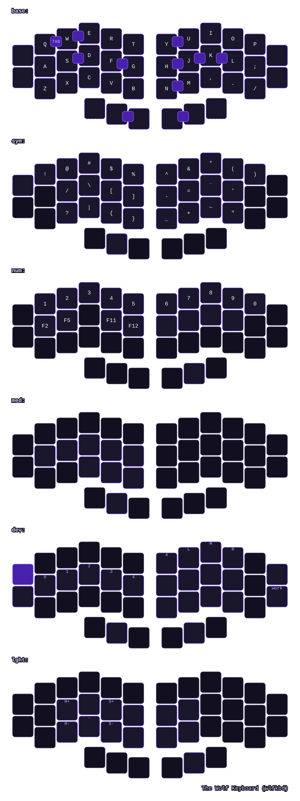

# The Wolf (wlfkbd) ZMK Firmware

Official ZMK firmware and keymap configuration for **The Wolf** (`wlfkbd`), a 40-key split keyboard.

- **Hardware Repository:** [WillACosta/wlfkbd](https://github.com/WillACosta/wlfkbd)
- **Keymap Editor:** Compatible with [Nick Coutsos' Keymap Editor](https://nickcoutsos.github.io/keymap-editor/)

## Current Keymap



## Features

- **Shields:** `wlf_left`, `wlf_right` (Seeed Studio XIAO BLE nRF52840)
- **Matrix:** 40 keys total (20 per half), column-staggered with splayed thumb cluster
- **Per-key Backlight:** PWM driven via `AO3400A` MOSFET
- **Status LEDs:** 4× SK6812 Mini-E addressable RGB LEDs per half, power-gated via `AO3407A` P-channel MOSFET (`STS_LED_EN` / `P0.10` active-low) and driven via SPIM3 MOSI (`STS_LED_DATA` / `P0.09`). Powered by [`zmk-rgbled-widget`](https://github.com/WillACosta/zmk-rgbled-widget) for clean, minimalist status indication (Connection, Battery, Layer, Combos) with automatic power gating.
- **Automated Keymap Drawer:** SVG and YAML keymaps auto-generated on push with `#4720ab` theme and Lucide Icons
- **Keymap Editor Ready:** Native `config/wlf.json` layout definition for visual editing

## Current firmware behavior

- Wireless BLE split: the left half is the central and the right half is the peripheral.
- Battery reporting for both LiPo-powered halves through ZMK's XIAO BLE board battery-voltage-divider support.
- The 40-key, 6-column × 4-row electrical matrix, including the missing outer-pinky bottom key and three thumb keys per half.
- Six layers: Base (0), Symbols (1), Numbers (2), Media (3), Device (4), and Light (5). Hold the left layer thumb for Symbols; tap once then hold it for Media. Hold the right layer thumb for Numbers; tap once then hold it for Light. Holding both layer thumbs activates Device.
- Bluetooth profile selection/clear and output switching on Device, plus NKRO, sleep, and short matrix debounce.
- Single-zone white backlight support: D10/P1.14 PWM drives the AO3400A low-side MOSFET; use Light `BL_ON`, `BL_OFF`, `BL_INC`, and `BL_DEC`.
- Status RGB LED widget (`zmk-rgbled-widget`):
  - **Connection:** Solid Blue for connected, breathing/pulsing Blue for disconnected/advertising, solid White for USB.
  - **Battery:** 80–100% Solid Green, 40–79% Solid Yellow, <40% Solid Red, Breathing Green when charging.
  - **Layers:** Base, Symbols, Numbers, and Media have no layer color; Device uses green and Light uses cyan.
  - **On-Demand & Energy Saving:** On the Base layer, press the left layer thumb + Space for Battery (`&ind_bat`), or Enter + the right layer thumb for Connection (`&ind_conn`). The configured external-power timeout is 15 seconds.
- **Pointing & Scrolling:** Mouse emulation is enabled with `CONFIG_ZMK_POINTING=y`. Device provides mouse movement, four-way scrolling (`&msc SCRL_*`), and mouse clicks. Smooth scrolling is not explicitly enabled in `config/wlf.conf`.

## Hardware mapping

The schematics define the same MCU pin assignments on both halves:

| Signal | XIAO pin |
| --- | --- |
| ROW0–ROW3 | D0–D3 |
| COL0–COL5 | D4–D9 |
| White backlight PWM | D10 / P1.14 |
| Status LED data (`STS_LED_DATA`) | NFC1 / P0.09 (SPIM3 MOSI) |
| Status LED power enable (`STS_LED_EN`) | NFC2 / P0.10 (AO3407A Gate, Active-Low) |

The diode cathodes connect to rows, so the scan direction is `col2row`. Main columns run left-to-right on both halves: left COL0–COL5 run outer-to-inner, while right COL0_R–COL5_R run inner-to-outer. The right overlay adds a six-column offset; the transform preserves this main-column order.

Both outer-pinky pairs use electrical rows 1 and 2, although their bindings occupy the first two logical keymap rows. Left SW2 (R1C0) maps to Shift/Escape, and SW1 (R2C0) maps to Left Control. Right SW22 (R1C5) maps to Backspace, and SW21 (R2C5) maps to Control/Escape. Neither outer column has a row-0 switch.

Thumbs in physical left-to-right order use left columns 3, 4, 5 (SW18, SW19, SW20) and right columns 2, 1, 0 (SW40, SW39, SW38), all on row 3. The shared transform maps these to GUI, left layer thumb, Space, Enter, right layer thumb, and Right Alt.

See the official ZMK [matrix transform](https://zmk.dev/docs/config/layout#matrix-transform) and [matrix scan](https://zmk.dev/docs/config/kscan#matrix-driver) documentation for how electrical coordinates map to logical key positions.

## Lighting Architecture: Backlight & Addressable RGB Coexistence

The Wolf incorporates both per-key monochrome backlighting (white dumb LEDs) and addressable RGB LEDs (4× SK6812 Mini-E status indicators per half). In ZMK firmware, these two systems operate concurrently without conflicts:

### 1. Independent ZMK Subsystems
- **White Backlight (`CONFIG_ZMK_BACKLIGHT`):** Driven by Zephyr's `pwm-leds` subsystem using the `&bl` behavior namespace (`&bl BL_TOG`, `&bl BL_INC`, `&bl BL_DEC`).
- **Status RGB LEDs (`CONFIG_ZMK_RGB_UNDERGLOW` & `zmk-rgbled-widget`):** Driven by Zephyr's `worldsemi,ws2812-spi` driver using the `&rgb_ug` namespace and custom widget behaviors (`&ind_conn`, `&ind_bat`).

### 2. Hardware Resource Independence (nRF52840)
- **Zero Peripheral Collision:** Backlight utilizes Nordic `PWM0` routed to pin `P1.14` (`D10`), while addressable RGB uses Nordic `SPIM3` MOSI on pin `P0.09` (`NFC1`). Because `PWM0` and `SPIM3` are completely distinct hardware peripherals on the nRF52840, there is no timer or DMA contention.
- **Dedicated Low-Side & High-Side Switching:** The backlight PWM signal drives the gate of an `AO3400A` N-channel MOSFET (switching ground). Status LED power is independently gated on the high side by an `AO3407A` P-channel MOSFET controlled by pin `P0.10` (`NFC2`).

### 3. Battery Conservation & Idle Management
- **Backlight Idle Off:** Managed by `CONFIG_ZMK_BACKLIGHT_AUTO_OFF_IDLE=y`. When the keyboard enters idle, the PWM duty cycle drops to 0%, turning off the low-side MOSFET (0 µA quiescent draw).
- **RGB Power Gating (`EXT_POWER`):** SK6812 addressable LEDs contain integrated control ICs that consume ~1 mA per LED even when displaying pure black. To prevent parasitic battery drain, ZMK's external power subsystem (`CONFIG_ZMK_EXT_POWER=y`) and `zmk-rgbled-widget` assert `P0.10` HIGH after 15 seconds of inactivity (`CONFIG_RGBLED_WIDGET_EXT_POWER_TIMEOUT_MS=15000`), physically disconnecting `VCC` from the LED strip.

## Build

The recommended build route is GitHub Actions in the firmware repository. The **Build ZMK firmware** workflow builds the three entries in [`build.yaml`](build.yaml): `wlf_left`, `wlf_right`, and `wlf_settings_reset`. Download and unzip the firmware artifact after the build completes.

For a local build with west and the Zephyr toolchain installed, run the following from the hardware repository root to initialize the configuration as a ZMK workspace, then build the two shields with the `xiao_ble//zmk` board. The required ZMK manifest is [`config/west.yml`](config/west.yml); its ZMK revision is `main`.

```sh
west init -l firmware/config
west update
west zephyr-export
west build -s zmk/app -d build/wlf-left -b xiao_ble//zmk -- -DSHIELD=wlf_left -DZMK_CONFIG="$PWD/firmware/config" -DZMK_EXTRA_MODULES="$PWD/firmware"
west build -s zmk/app -d build/wlf-right -b xiao_ble//zmk -- -DSHIELD=wlf_right -DCONFIG_ZMK_STATUS_ADVERTISEMENT=n -DZMK_CONFIG="$PWD/firmware/config" -DZMK_EXTRA_MODULES="$PWD/firmware"
```

## Flashing Instructions

1. Put the keyboard half into bootloader mode by pressing the reset button twice quickly.
2. A mass storage device (`XIAO-BLE` or `NRF52BOOT`) will appear on your computer.
3. Download the firmware artifact (`wlf_left.uf2` or `wlf_right.uf2`) from GitHub Actions Releases/Artifacts.
4. Drag and drop the corresponding `.uf2` file onto the drive.
5. Repeat for the other half.

After changing the shared matrix transform, rebuild and flash both halves. Check each key individually, including left R2C0 (Left Control), both outer-pinky pairs, and all six thumbs. On the right, the top row should produce Y, U, I, O, P, and Backspace from inner to outer.
